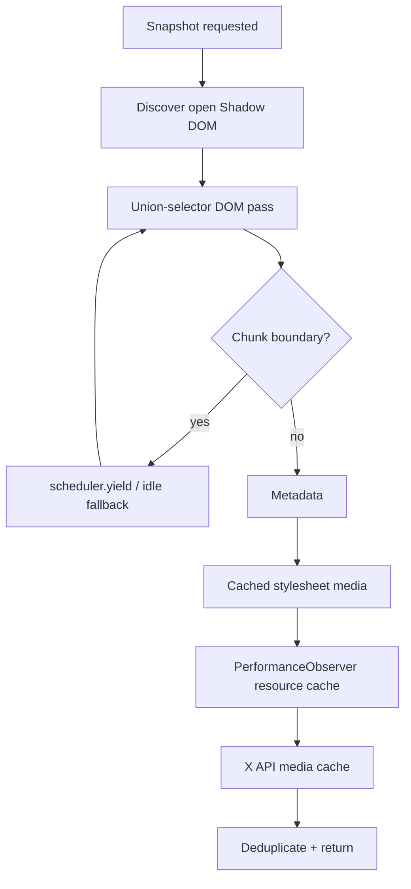

# Performance Architecture

MediaForge's performance rule is simple: **find everything, but never make “find everything” synonymous with “block the browser.”**

## Zero idle tax on generic pages

Generic pages do not run an eager deep scan and do not keep a full-document mutation observer alive. The live DOM is scanned cooperatively when the panel requests media. X/Twitter keeps only a targeted dirty-article observer because inline download buttons must follow its recycled post DOM.

## Cooperative deep scanning

The deep frame snapshot is asynchronous. Work is broken into chunks and yields to Chromium between chunks.



When supported, MediaForge uses the Prioritized Task Scheduling API's `scheduler.yield()` / `scheduler.postTask()` behavior. Fallback paths use idle callbacks or a zero-delay task so the extension remains compatible with Chromium environments that do not expose the newer scheduler API.

## Dirty-region X updates

X is a constantly mutating SPA. Earlier behavior could rescan all articles after every mutation. 0.3 tracks the article containing an added subtree and only reprocesses that dirty article, with one full initial sweep.

## Virtualized side panel

The panel keeps the full logical result list but initially creates only 72 card DOM trees. An `IntersectionObserver` materializes the next batch before the sentinel reaches the viewport.

This preserves:

- complete sort/filter counts;
- complete selection semantics;
- complete bulk download/ZIP/copy behavior;
- much smaller initial DOM/layout/paint work.

## Lazy thumbnail activation

Cards can exist without immediately assigning a thumbnail `src`. A second `IntersectionObserver` activates thumbnails roughly 600 px ahead of the viewport.

## CSS rendering containment

Cards use:

```css
content-visibility: auto;
contain: layout paint style;
contain-intrinsic-size: auto 92px;
```

This lets Chromium skip layout/paint work for offscreen card contents.

## Metadata single-flight

The service worker stores both a TTL metadata cache and an in-flight promise map. Concurrent requests for the same URL share one HEAD/Range operation instead of launching duplicate network requests.

## Workload model

Run:

```bash
npm run perf:model
```

The 0.3 reference workload currently models 99.58% fewer repeated X article inspections, 96.40% fewer initial card DOM constructions for a 2,000-item result set, and 85.71% fewer core media selector passes per root.

These values are deterministic workload reductions, not universal browser FPS promises.

## 0.3.1 side-panel CPU fast path

The panel now prepares immutable-ish derived fields once per media record (`_file`, `_host`, `_pixels`, `_search`, `_searchLower`), snapshots filter controls once per render, reuses one `Intl.Collator`, and resolves selections through the O(1) record map. This removes repeated URL parsing, string joins/lowercasing, DOM-control reads, and locale-collator construction from the per-record/per-comparator hot path.

`npm run perf:ui` runs a parity-checked 20,000-record search/filter/name-sort workload. On the release environment, the median fell from **951.204 ms** to **66.130 ms** (**14.38x faster; 93.05% less CPU time**) with the same **17,557 records** and checksum **878587171**. The benchmark verifies result parity before it reports timing.

Automatic metadata enrichment is scheduled at background priority after the initial list paints unless the current sort depends on metadata immediately. Navigation-driven reloads are coalesced. Deep frame snapshots themselves are now started inside `scheduler.postTask(..., {priority: "background"})` when available, so their internal `scheduler.yield()` calls inherit background priority and let page input/rendering win scheduling conflicts.


## 0.4 smart-filter fast path

Media classification is computed once per prepared media record and cached. Quick-filter passes reuse that cached result instead of rescoring dimensions, URL/name hints, source semantics, and provider metadata on every search/filter interaction.

`npm run perf:smart` parity-checks the cached classifier against recomputing the identical classifier across 30,000 records. On the release environment, median time fell from **55.362 ms** to **0.246 ms** (**225.2x faster; 99.56% less CPU time**) with the same **26,063 result records**.