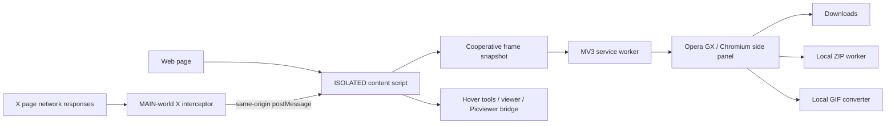

# MediaForge GX

> **A local-first media power tool for Opera GX and Chromium.** Deep page discovery, smart content-vs-junk filtering, best-quality X/Twitter downloads, high-fidelity long-video GIF conversion, first-class audio discovery, provider-aware YouTube/Spotify handling, ZIP export, Picviewer CE+ coexistence, and a persistent browser side panel — designed to stay responsive even on media-heavy pages.

[Repository](https://github.com/Herbertofury/MediaForge) · [Install](Installation) · [Smart Content Filtering](Smart-Content-Filtering) · [GIF Conversion](GIF-Conversion) · [Audio & Streaming Platforms](Audio-and-Streaming-Platforms) · [Performance Architecture](Performance-Architecture) · [Troubleshooting](Troubleshooting)

---

## 0.4.1: real content first

MediaForge now uses an **instant content lane** before the complete deep scan. X tweet/post media and other semantic/visible content can appear immediately, while iframe, Shadow DOM, stylesheet, metadata, and network-resource discovery continues afterward and merges without deleting anything. X sports widgets, profile/avatar assets, sidebar/navigation chrome, trackers, and other page furniture are strongly demoted from **Best content**.

## What MediaForge GX does

MediaForge GX combines the strongest workflows from bulk image downloaders, media sniffers, dedicated X/Twitter downloaders, and image viewers without turning browsing into a permanent full-page crawl.

| Area | MediaForge GX |
| --- | --- |
| Images | Original/lazy/srcset/picture/CSS/SVG/metadata/resource discovery |
| Video | Direct page video, X direct MP4 variants, posters, linked media |
| Audio | Direct page audio and linked audio |
| X/Twitter | Original photos, best visual-quality MP4, animated-GIF-as-MP4 handling |
| Bulk UX | Search, regex, sort by real size, resolution, dimensions, type, name, URL |
| Output | Direct download, Save As, ZIP, copy URLs, JSON manifest, MP4 → real GIF |
| Viewer | Hover tools, fullscreen viewer, rotate/flip/zoom, Picviewer CE+ bridge |
| Browser | Opera GX sidebar + Chromium side panel |
| Privacy | Local-first, no analytics SDK, no remote conversion service |

## Architecture at a glance

## 0.4.0 — content intelligence + GIF reliability

- **Best content** is now the default side-panel view. It locally scores every result and hides probable ads/promos, trackers, icons, emoji, avatars, loading assets, tiny page chrome, and adaptive-stream fragments. **All** still exposes the complete scan; nothing is deleted.
- Quick chips jump instantly between Best content, All, Photos, Video, Audio, Ads/promos, and UI/tiny.
- Long MP4→GIF conversion now waits for a compositor-delivered decoded frame, uses exact long-run centisecond timing, folds exact duplicate frames, and writes the GIF into chunks instead of one repeatedly reallocated buffer.
- Maximum GIF quality uses a 256-color local palette plus deterministic ordered dithering to improve gradients without random temporal shimmer.
- YouTube, Spotify, SoundCloud, and Bandcamp player pages are provider-aware: title/artwork/media semantics are surfaced while streamed/protected players are not mislabeled as ordinary direct files.
- Direct audio discovery covers MP3, M4A, AAC, OGG/OGA, Opus, WAV, and FLAC plus JSON-LD/resource-hint metadata.
- Metadata enrichment still covers every record, but likely content is probed first so useful size/resolution data appears sooner.

The 30,000-record smart-filter benchmark measured cached classification at **0.246 ms median** versus **55.362 ms** for recomputing the identical classifier on every filter pass — **225.2× faster / 99.56% less CPU** in the release environment.

## 0.3.1 performance architecture

MediaForge GX 0.3 moves expensive work away from browsing-critical paths:

- X mutation handling now decorates only **dirty/new articles**, instead of rescanning every article after every mutation.
- Deep page scans use a **cooperative async snapshot** that yields between chunks using `scheduler.yield()` when supported, with an idle/timer fallback.
- Core DOM media sources are collected through a **single union selector pass per root** instead of seven independent query passes.
- Open Shadow DOM discovery is cooperative, cached, and deferred; it avoids repeatedly allocating a full `querySelectorAll('*')` result during normal browsing.
- Resource Timing is fed into a **PerformanceObserver cache**, so already-seen resources do not require a fresh full resource-table sweep on every scan.
- Stylesheet media extraction is cached and invalidated only when stylesheet/style nodes change.
- The side panel is **virtualized in 72-card batches**, with `IntersectionObserver` loading the next batch only as it nears the viewport.
- Thumbnail URLs are attached only near the viewport, rather than starting every image request at once.
- Search/filter UI rerenders are coalesced into animation frames and text search is lightly debounced.
- Metadata probes are cache + single-flight protected, preventing duplicate concurrent HEAD/Range requests for the same URL.
- `content-visibility:auto` and CSS containment let Chromium skip offscreen card rendering work.

The goal is zero feature loss: the complete result set still exists logically and bulk operations act on the complete selection even when only a viewport-sized subset of cards has been materialized.

## Zero idle tax on generic pages

Generic pages do not run an eager deep scan and do not keep a full-document mutation observer alive. The live DOM is scanned cooperatively when the panel requests media. X/Twitter keeps only a targeted dirty-article observer because inline download buttons must follow its recycled post DOM.

## Performance contract

The repository includes `npm run perf:model`, a deterministic hot-path workload model. With its 0.3 reference workload:

| Hot path | 0.2-style workload | 0.3 workload | Reduction |
| --- | ---: | ---: | ---: |
| X article inspections across 1,200 mutation waves / 300 articles | 360,000 | 1,500 | **99.58%** |
| Initial card DOM creation for a 2,000-item gallery | 2,000 | 72 | **96.40%** |
| Core media selector passes per root | 7 | 1 | **85.71%** |

These are workload reductions, not synthetic FPS claims. Real-world gain depends on the page, browser, network, and device.

## Start here

- **New user:** [Installation](Installation)
- **Want every possible page asset:** [Media Discovery](Media-Discovery)
- **Want bulk downloader workflows:** [Bulk Downloader](Bulk-Downloader)
- **Want X/Twitter best quality:** [X / Twitter](X-Twitter)
- **Want to understand why it stays responsive:** [Performance Architecture](Performance-Architecture)
- **Using Picviewer CE+:** [Picviewer CE+ Integration](Picviewer-CE-Integration)
- **Something not detected:** [Troubleshooting](Troubleshooting)

## 0.3.1 measured UI fast path

The current release pre-indexes search/sort metadata, snapshots filter state once per render, reuses collation state, and keeps metadata work at background priority unless the user asks for a metadata-dependent sort. A parity-checked 20,000-record benchmark measured **14.38x faster** search/filter/name-sort execution (**951.204 ms → 66.130 ms median; 93.05% less CPU**) with identical result count and checksum.
