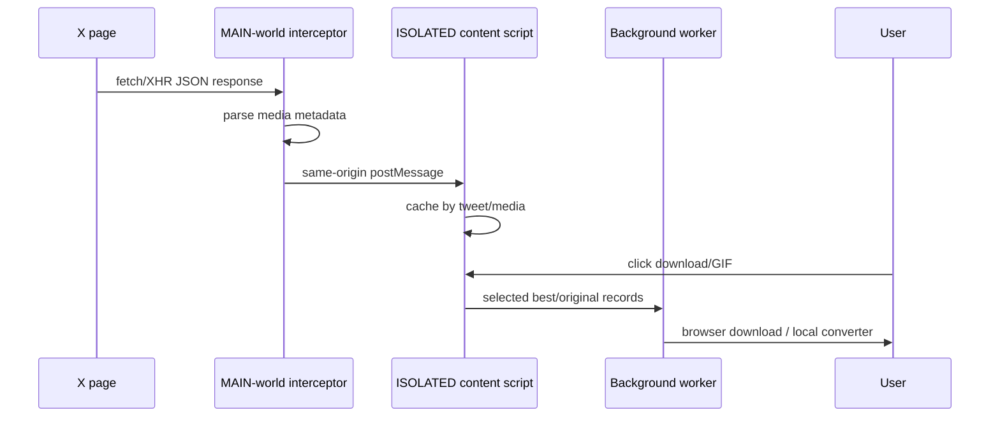

# X / Twitter

## Why X needs special handling

X commonly feeds `<video>` from `blob:` URLs. The downloadable MP4 variants exist in X's own JSON responses, not necessarily in the final DOM.

MediaForge uses two worlds:

## Video quality

Direct MP4 variants are ranked by **visual area first, bitrate second**. This avoids choosing a high-bitrate but lower-resolution rendition when X exposes multiple variants.

## Animated GIFs

X “GIFs” are normally MP4 animations. MediaForge offers both:

- the best direct MP4;
- local conversion into an actual `.gif`.

## Photos

`pbs.twimg.com` photo URLs are upgraded to `name=orig` when possible.

## Inline controls

MediaForge adds a compact best/original download control to X action rows and a contextual GIF button for animated media.
